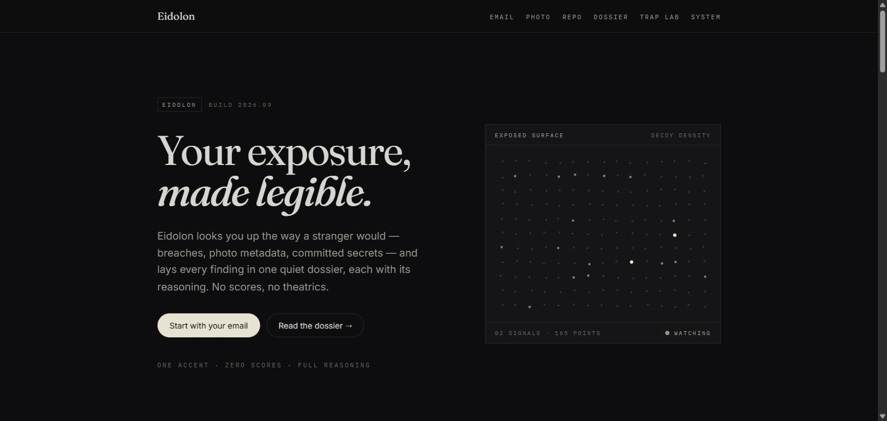
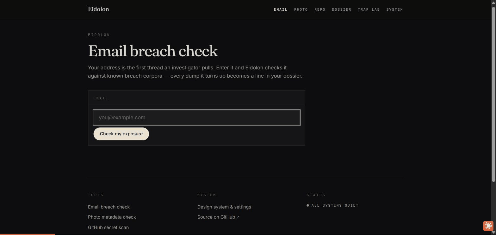

# Eidolon

[](LICENSE)


> Eidolon answers one question: what can someone discover about you without you realizing it?



## Contents

- [What it does](#what-it-does)
- [Status](#status)
- [Structure](#structure)
- [Running locally](#running-locally)

## What it does

Eidolon works in two movements.

**The Mirror** shows you your own exposure — the same footprint an attacker would find:

- **Breach & password exposure** — checks an email against known breaches and scores password strength
- **Photo metadata** — pulls EXIF/GPS data out of a photo to show what it leaks about where it was taken
- **Repo secret scanning** — scans a GitHub user's public repos for committed secrets

Every check lands in one running dossier, and every finding comes with a reasoning panel
explaining why it matters — no numeric exposure score. That's deliberate: a single number invites
false confidence, so Eidolon sticks to narrative findings with full reasoning instead.



**The Trap** plants deception tied to what the Mirror finds, so if someone acts on that exposure, you
know. Right now that's one working trap type: a decoy API key (`eidolon_live_...`) that's
self-verifying via an HMAC signature — no database required — and posts a Discord alert with the
requester's IP and rough geolocation the moment it's used. Other trap types (tied directly to
Mirror findings) aren't built yet.

## Status

- **Mirror** — complete: all three checks above are built and working end to end.
- **Trap** — in progress:
  - [x] Honeytoken (self-verifying decoy API key, Discord webhook alert)
  - [ ] Wire honeytoken generation into Mirror dossier findings

`legacy/` holds the previous implementation for reference only — it isn't part of the build.

## Structure

- `backend/` — FastAPI service (exposure checks + trap endpoints)
- `frontend/` — React + Vite + Tailwind UI

## Running locally

```bash
# backend
cd backend
python -m venv .venv && source .venv/Scripts/activate
pip install -r requirements.txt
uvicorn main:app --reload --port 8001

# frontend
cd frontend
npm install
npm run dev
```
